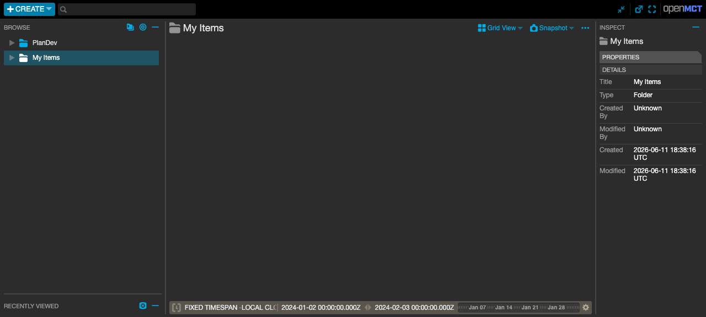
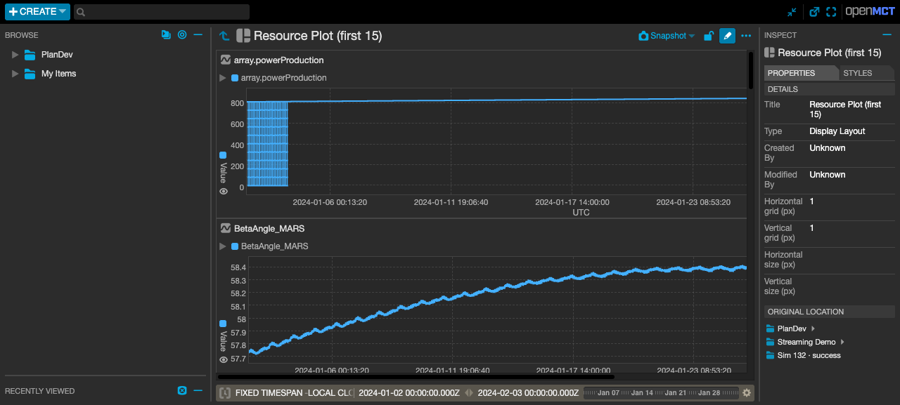
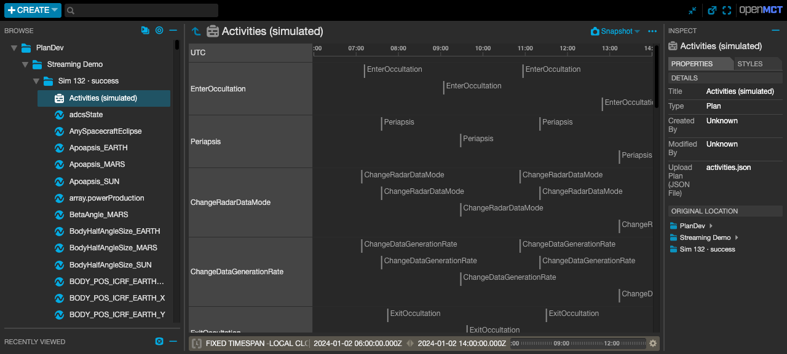
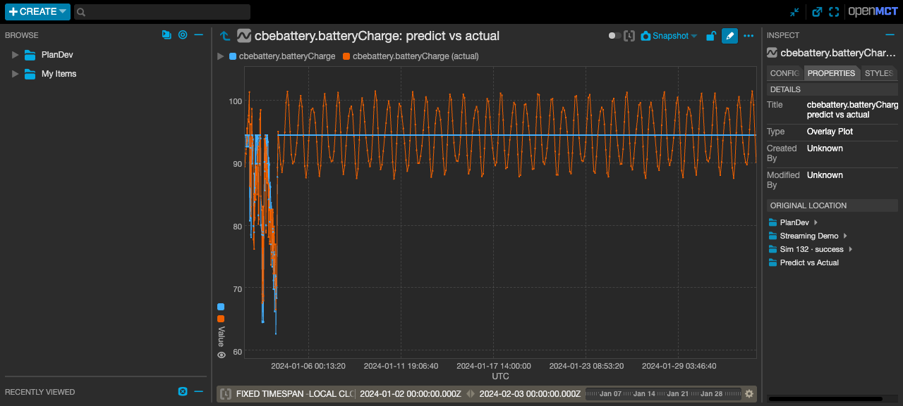

# openmct-plandev — PlanDev inside OpenMCT (experimental demo)

> ⚠️ **Experimental demo — not a supported or production plugin.** It exists
> to *explore* how PlanDev data could surface in [NASA OpenMCT](https://github.com/nasa/openmct)
> and to make the close-the-U idea tangible. Expect rough edges; structure, naming,
> and behavior will change. Don't depend on it. The "actuals" are **synthesized**
> (predict + noise), not real telemetry, and auth/CORS/perf are demo-grade only.

A small, self-contained experiment that pulls **PlanDev** (Aerie) planning data into
OpenMCT, two ways:

- **Resources as telemetry** — each simulated resource profile becomes an OpenMCT
  telemetry object: numeric resources **plot**; enum/boolean *state* resources plot as
  a **stepped state line** (OpenMCT maps the states to levels); free-form string
  resources (e.g. `/producer`) **also plot** as a stepped state line — their states are
  discovered from the profile (or fall back to a table if there are too many).
- **The plan as an OpenMCT Plan object** — a simulation's activity spans become a
  Plan/Gantt object, so you see **planned activities alongside predicted resources**.
- **External events as a timeline** — a plan's derived external events (DSN contacts,
  view periods, …) become a Plan/Gantt object grouped by event type, so ground-station
  contacts and the like sit alongside the activities + resource predicts.

It reads PlanDev's Hasura GraphQL directly through a small, framework-agnostic
client. **No `plandev-ui` or backend changes** are required — everything lives on
the OpenMCT side.

It's a sketch of **Track B / Phase B** of the [PlanDev × OpenMCT integration memo](../../../claude-plans/plandev/plandev-openmct-integration.md)
(`~/code/claude-plans/plandev/plandev-openmct-integration.md`) — the "OpenMCT pulls
from PlanDev" direction — built here to learn from, not to ship. If the approach
proves out, the real version would be extracted and hardened separately.

### What this is / isn't

- **Is:** a throwaway-grade spike to validate the integration shape (object tree,
  telemetry mapping, plan-as-Gantt, predict-vs-actual overlay) against a live backend.
- **Isn't:** supported, secure, performance-tuned, or API-stable. Several behaviors
  are deliberately the simplest thing that works (see [Demo-grade simplifications](#demo-grade-simplifications)).

| Tree (Plans → Sims → Resources) | Ready-made Resource Plot | Activities as a Gantt |
|---|---|---|
|  |  |  |

## What you get

```
PlanDev                         ← tree root
└── <Plan name>                 ← each PlanDev plan   (Inspector → "PlanDev": owner, model, start/end, tags, …)
    ├── Sim <id> · <status>      ← each simulation dataset
    │   ├── Resource Plot (first 15) ← ready-made Display Layout: first 15 plottable resources, each a tall plot frame
    │   ├── Predict vs Actual        ← close-the-U: Overlay Plots of predict vs synthesized actual
    │   ├── Activities (simulated)   ← Plan object → Gantt / Time-List / Time-Strip
    │   ├── <resource A>             ← telemetry (numeric → plot, enum/bool/string → stepped state plot)
    │   └── …
    └── External Events          ← (when the plan links derivation groups) derived events → Gantt, by type
```

Each sim ships a **ready-made "Resource Plot"** — a view-only **Display Layout** with
the first 15 *plottable* resources (numeric **and** enum/boolean state), each in its
own explicitly-sized plot frame (default 240px tall, tunable via `resourcePlotHeightPx`).
Open it, set the conductor to the sim's span, and scroll through tall, readable plots
that all stay synced to the time conductor. (Display Layout is OpenMCT's CSS-free way
to give plots an explicit height; the trade-off is a fixed canvas width —
`resourcePlotWidthPx`, default 1000.) To customize, build your own Overlay/Stacked
Plot, Time Strip, or layout under *My Items*.

A status-bar **"PlanDev" connectivity light** shows green when the backend is
reachable, and selecting a plan/sim reveals a **"PlanDev" inspector panel** with its
metadata — see [Resilience, connectivity & metadata](#resilience-connectivity--metadata).

## Prerequisites

- **Node 18+**
- **A running PlanDev backend** reachable on this machine, with at least one plan
  that has a **completed simulation**. Defaults assume the standard local
  deployment:
  - Hasura GraphQL at `http://localhost:8080/v1/graphql`
  - Gateway at `http://localhost:9000` (with `AUTH_TYPE=none`, the default dev mode)

  If your backend lives elsewhere or uses auth, see [Configuration](#configuration).

## Quick start

```bash
cd examples/openmct-demo
npm install          # pulls openmct + build/test tooling
npm run build        # bundles the plugin → host/lib/openmct-plandev.js
npm start            # serves the host at http://localhost:8888
npm test             # (optional) runs the unit tests for the pure logic
```

Open **http://localhost:8888** and:

1. Expand **PlanDev** in the left tree → pick a plan → pick a **`· success`** sim.
2. Click **Resource Plot (first 15)** → an instant dashboard of tall resource plots.
3. Or click an individual numeric resource (e.g. `array.powerProduction`,
   `BetaAngle_MARS`) → it opens as a **plot**; an enum/boolean/string state resource
   (e.g. `adcsState`, `/flag`, `/producer`) → a **stepped state plot** with the state
   names on the y-axis.
4. Click **Activities (simulated)** → the sim's activities render as a **Gantt**.

The time conductor opens on the most recent plan's full span. **Zoom in** (drag the
conductor or set a narrower fixed range) to see individual activities in the Gantt —
at full-plan zoom, short activities are sub-pixel. (See `minActivityDurationMs` below
to make them visible at any zoom.)

`npm run dev` builds and starts in one step.

## Configuration

Two layers, both optional:

**Browser-side** — [`host/config.js`](host/config.js) sets `window.PLANDEV_CONFIG`:

| key | default | meaning |
|---|---|---|
| `graphqlUrl` | `/api/graphql` | Hasura endpoint — a same-origin proxy path that attaches auth (see [Authentication](#authentication)) |
| `healthUrl` | `/api/health` | liveness endpoint for the status-bar connectivity light |
| `planDevUiUrl` | `''` | base URL of the PlanDev (Aerie) UI for "Open in PlanDev" backlinks; e.g. `http://localhost:3000`. Omit to hide the link |
| `namespace` | `plandev` | OpenMCT namespace for PlanDev objects |
| `minActivityDurationMs` | `0` | floor for zero-duration activity spans so they show as bars; e.g. `600000` (10 min) for a denser Gantt at full zoom |
| `resourcePlotHeightPx` | `240` | per-plot frame height in the "Resource Plot" Display Layout — the CSS-free way to set plot height |
| `resourcePlotWidthPx` | `1000` | per-plot frame width in the "Resource Plot" layout (fixed canvas) |
| `resourceValueFormat` | `%.3f` | printf format for real resource values; `''` to disable (a fixed-decimal format can clip very small magnitudes) |

**Server-side** — [`host/server.mjs`](host/server.mjs) proxies the same-origin
`/api/*` paths to PlanDev (this sidesteps CORS — the browser only talks to the
host). Point it at a different backend with env vars:

```bash
PLANDEV_HASURA_URL=http://my-host:8080/v1/graphql \
PLANDEV_GATEWAY_LOGIN_URL=http://my-host:9000/auth/login \
PLANDEV_HEALTH_URL=http://my-host:8080/healthz \   # optional; defaults to Hasura's /healthz
PORT=8888 npm start
```

The host also proxies **`/api/health`** → Hasura's `/healthz` for the connectivity light.

## Authentication

**The plugin sends no credentials** — it just POSTs queries to `graphqlUrl`, and a proxy
in front attaches auth. That keeps the browser from holding a token or choosing a Hasura
role (the real Aerie SPA does both, but you don't want that in an embedded, exposed,
read-only view).

The bundled `host/server.mjs` is that proxy: it logs in once with a **service account**
and **injects `Authorization` + a pinned `x-hasura-role`** on every `/api/graphql` call.
Out of the box it uses `openmct-demo` / role `viewer` (works with `AUTH_TYPE=none`);
override for a real backend:

```bash
PLANDEV_SERVICE_USER=openmct-bridge \
PLANDEV_ROLE=viewer \
PLANDEV_SERVICE_PASSWORD=…   # if PlanDev auth is enabled
PORT=8888 npm start
```

Pinning the role server-side also avoids *"requested role is not in allowed roles"*: it's
fixed to one the service account is allowed, instead of the client requesting an arbitrary
one.

> **Dropping the plugin into your own OpenMCT host?** Auth/CORS is your deployment's job
> (true of any OpenMCT telemetry plugin). Point `graphqlUrl` at a proxy that injects the
> token + role — `host/server.mjs` is a working reference to copy or adapt.

## How it works

The plugin (`plugin/src/`) registers its providers with OpenMCT:

| File | Role |
|---|---|
| [`plandev-api.ts`](plugin/src/plandev-api.ts) | Framework- and **auth-agnostic** typed client over PlanDev's Hasura GraphQL — sends no credentials (the host proxy attaches them); 6-way concurrency cap + per-request timeouts. **Intentionally self-contained** (owns its ~6 queries + result types) rather than depending on `@plandev/api` — see the memo. |
| [`object-provider.ts`](plugin/src/object-provider.ts) | Resolves any tree node (Root / Plan / Sim / Resource / Plan-object / status) to an OpenMCT domain object. Wrapped so a failed load surfaces a toast + placeholder, never a crash. |
| [`composition-provider.ts`](plugin/src/composition-provider.ts) | Lists each container's children lazily: Root→Plans, Plan→Sims, Sim→Activities+Resources. Surfaces empty/unreachable states as tree nodes. *Dynamic* — refreshes the tree in place on Reload. |
| [`telemetry-provider.ts`](plugin/src/telemetry-provider.ts) | Historical telemetry: windows the resource's (cached) sampled datums to the request, min/max-decimates real-profile plots to the point budget, and alerts (doesn't spin) on a load failure. |
| [`inspector-view.ts`](plugin/src/inspector-view.ts) | The "PlanDev" inspector panels — plan/sim metadata and selected-activity (span id / arguments / computed attributes) — plus "Open in PlanDev" backlinks. |
| [`plan-object.ts`](plugin/src/plan-object.ts) | Builds OpenMCT Plan bodies — a sim's activity spans (grouped by type, enriched with span id / arguments / computed attributes) and a plan's external events (grouped by event type). |
| [`sample.ts`](plugin/src/sample.ts) / [`metadata.ts`](plugin/src/metadata.ts) | Port of PlanDev's `sampleProfiles` (+ min/max decimation) and `ValueSchema`→OpenMCT metadata mapping (incl. enum/state telemetry). |
| [`identifiers.ts`](plugin/src/identifiers.ts) | Self-describing object keys. Resource names are URL-encoded so names with `/` or `:` (e.g. `/data/line_count`) round-trip safely through OpenMCT's keyStrings. |

Resource values are anchored at the plan start time (matching how `plandev-ui`
samples internal-sim resources) and emitted as `{ utc: epochMs, value }` datums.

## Resilience, connectivity & metadata

The plugin assumes PlanDev can be slow, unreachable, or partial, and tries to make
that legible rather than silent:

- **Connectivity light** — a status-bar `URLIndicator` polls `/api/health` (Hasura's
  `/healthz`) and shows green ("PlanDev is connected") / yellow ("offline").
- **Error toasts** — a failed plan/sim/resource/telemetry load raises a dismissible
  error notification with the reason (the upstream/proxy message is surfaced, not just
  a status code); identical messages are de-duped within a few seconds.
- **Tree affordances** — an unreachable backend shows a **⚠ Could not reach PlanDev**
  node at the root; an empty deployment shows **No PlanDev plans found**. A resource
  whose profile type fails to load is named with a **⚠** so the failure persists after
  the toast.
- **No hangs / no crashes** — every `fetch` has a request timeout (default 30 s), a
  failed login backs off briefly instead of hammering the gateway, and a telemetry
  object always carries a valid range value so OpenMCT's Plot can't crash on it.
- **Metadata & backlinks** — a **"PlanDev" inspector panel** for the selected object: a
  **plan** shows owner, model (name + version), start/end, duration, tags; a **sim**
  shows status + sim start/end; a **resource** shows name, data type, unit, and
  description; an **activity** shows name, type, span id, arguments, and computed
  attributes; an **external event** shows key, type, source, derivation group, and
  attributes. Set `planDevUiUrl` to add an **"Open in PlanDev ↗"** link back to
  the Aerie UI, carrying the plan's time range, the `simulationDatasetId` (sims), and the
  `spanId` (activities) — e.g. `/plans/3?startTime=…&endTime=…&simulationDatasetId=7&spanId=7`.

## Demo-grade simplifications

Things that are deliberately the simplest-thing-that-works, not production choices:

- **Actuals are synthesized**, not real telemetry — predict + drift/noise ([actuals.ts](plugin/src/actuals.ts)).
- **Historical only** — completed sims; no realtime streaming.
- **Decimation** — real (continuous) profiles are **min/max-decimated** to the plot's
  point budget (`strategy:'minmax'` + `size` ≈ pixel width), preserving spikes, so a
  profile with thousands of segments stays responsive. Sampled datums are cached, so
  pan/zoom re-windows + re-decimates in memory (no refetch). Discrete/state series and
  non-plot views (tables, LAD/meters) get full data, so they stay exact.
- **Discrete plotting** — enum/boolean state resources plot via OpenMCT's enum
  formatter (state → numeric level), built from the schema. **Free-form string**
  resources have no fixed value set in the schema, so we discover their states by
  fetching the profile once at resolution (cached; capped at 30 distinct states, beyond
  which they stay a table). OpenMCT renders these as a **stepped state line**, not
  PlanDev's colored-segment bars — that exact look would need a custom view.
- **The Plan object uses simulation _spans_** (real durations → accurate Gantt bars)
  rather than raw activity directives. Zero-duration events are point markers unless
  `minActivityDurationMs` is set.
- **Resource time is anchored to the plan start** (matching `plandev-ui`'s internal-sim
  path); sims starting at an offset from plan start aren't handled specially.
- **Displays are view-only** and provider-supplied; auth is gateway-login with a
  demo username; the host proxy is a minimal dev server.

## Close the U (predicts vs actuals)

Each sim has a **Predict vs Actual** folder with an Overlay Plot per resource,
each overlaying the **predicted** profile (from the PlanDev sim) against a
**synthesized "actual"** — the predict perturbed by a slow drift + small wiggle
([actuals.ts](plugin/src/actuals.ts)). The lines diverge, which is the
"close-the-U" signal a planner would replan against. (The overlay is numeric-only —
perturbing an enum/state value isn't meaningful.)



**Why synthesized, and why no separate server?** Real close-the-U needs actuals
that *correspond* to predicts — same channel, comparable time. The OpenMCT
tutorial's reference server emits unrelated random channels at realtime, so it
can't be overlaid meaningfully as-is, and a bespoke mission model matched to its
dictionary would be backwards. Instead we derive actuals from the sim itself, on
the same channels, over the plan's own time span (a **static replay**). For static
replay we implement the tutorial's **historical-provider pattern**
(`request(obj, {start, end}) → datums`) directly in the plugin — no extra server
to run. The actuals perturbation is a pure function of `(timestamp, resource)`, so
the actual line is stable across pans/zooms.

The **live** variant — streaming actuals over a WebSocket, shifted to "now" — is
where the tutorial's realtime server comes in; see [Next steps](#next-steps).

## Troubleshooting

- **Resources show no data / "nothing appears."** The time conductor must overlap
  the simulation's time range. A resource opened with the conductor outside the
  sim's span plots empty — that's expected, not an error. Set the conductor to the
  sim's range (the demo auto-opens on the latest plan's span; older plans/sims may
  need you to adjust it).
- **The "PlanDev" status light is yellow.** The backend isn't reachable at
  `/api/health` (Hasura `/healthz`). Check the server is up and the proxy targets
  (`PLANDEV_HASURA_URL`, etc.) are correct; you'll also see an error toast on the
  first failed load.
- **New plans/sims don't appear — or a sim's status stays stale — after I change them
  in PlanDev.** Use the **Reload** action on the PlanDev node. Our composition provider
  is *dynamic*: reload re-pulls the node and emits a **minimal diff keyed by a per-child
  signature** (a sim's signature includes its status). So a finished sim
  (pending→success), a new plan/sim, or a removed one refreshes — while every unchanged
  node, including expanded ones, stays put. Order is newest-first (id desc); a
  re-resolved or newly-added item lands at the bottom (OpenMCT appends on add) until the
  next full reload. A true in-place label update without that reorder would need OpenMCT
  "mutable objects" — which also makes nodes editable, so we don't.
- **A Sim folder with hundreds of resources is slow to fully populate.** The API
  client caps concurrent GraphQL requests (default 6, matching the browser's
  per-origin connection limit) so a large folder loads **progressively** instead of
  flooding the browser (`net::ERR_INSUFFICIENT_RESOURCES`). Profiles are cached, so
  it's a one-time cost per resource.
- **Console warnings from the Plan view in narrow frames** (`<svg> attribute width:
  negative`, `reading 'ticks'`, `xScale is not a function`). These come from
  OpenMCT's own Plan view (`PlanView.vue` computes `clientWidth - 200`), which throws
  when rendered in a container narrower than ~200px. Open the Activities object
  full-size (or widen its frame) and it renders correctly; the warnings are upstream
  and cosmetic.

## Next steps

- **Live close-the-U**: stream actuals over a WebSocket (the OpenMCT tutorial's
  realtime-server pattern), shifting both predict and actual to "now", so the actual
  ticks in and diverges live. Builds on the static `Predict vs Actual` plots above.
- A bundled **demo plan + minimal mission model** so the example is runnable without
  an existing PlanDev plan.
- **Richer activity metadata** — surface each span's arguments / computed attributes
  (already fetched in `span.attributes`) in an activity inspector panel; optionally
  join the source directive for authored args/tags.

> **Note:** `plandev-api.ts` is intentionally **not** migrated to the shared
> `@plandev/api` package. A 6-query, read-only browser consumer is better off owning
> its thin query+type set than coupling to the UI's query selections; `@plandev/api`
> is the right call for broad / write-heavy consumers. See the integration memo.
